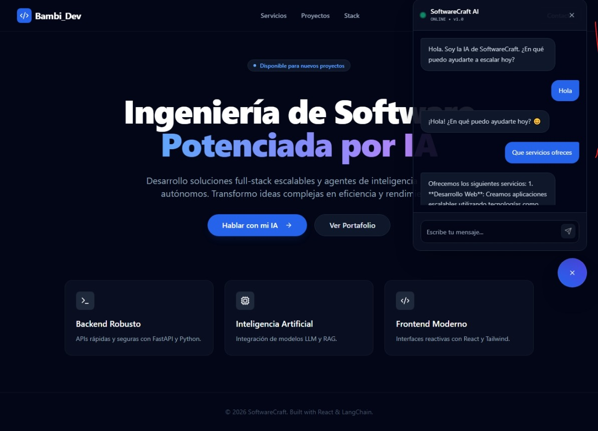

# Bambi-Dev AI 🚀


> **"Practicando con LangChain"**
>
> Este es un primer deploy de lo que fue mi primer proyecto con LangChain.

## 📋 Sobre el Proyecto

Este repositorio aloja una solución **Full-Stack de Inteligencia Artificial** diseñada con una arquitectura moderna y desacoplada. El objetivo es demostrar la integración de un **Agente Autónomo (RAG + LLM)** capaz de razonar sobre datos empresariales, servido a través de una API y consumido por una interfaz "Enterprise".

### ✨ Características Principales

* **Frontend Moderno:** Landing page de alta conversión y Widget de Chat flotante construidos con **React**, **Vite** y **Tailwind CSS**.
* **Diseño UI/UX:** Implementación de **Shadcn/UI** para componentes accesibles y estética "Dark Mode SaaS".
* **Backend Asíncrono:** API REST construida con **FastAPI** para manejar peticiones concurrentes de alta velocidad.
* **Inteligencia Artificial:** Agente orquestado con **LangChain**, con capacidad de memoria conversacional y recuperación de contexto (RAG).

---

## 📸 Demo e Interfaz

| UI Principal Page | API de Chat AI |
|:---:|:---:|
|  |  |

---

## 🏗 Arquitectura del Proyecto

El proyecto sigue una estructura de **Monorepo Híbrido**:

```text
/
├── client/                 # 🎨 FRONTEND (React + Vite)
│   ├── src/components/ui/  # Componentes reutilizables (Shadcn)
│   ├── src/lib/            # Utilidades y configuración de Tailwind
│   └── src/ChatWidget.jsx  # Lógica de conexión con el Agente
│
├── src/                    # 🧠 BACKEND (Python + FastAPI)
│   ├── api/main.py         # Entry point de la API
│   ├── components/         # Lógica del Agente y Cadena (Chain)
│   └── data/               # Base de datos vectorial (ChromaDB)
│
└── requirements.txt        # Dependencias de Python
```

## ⚡ Guía de Instalación Local
Sigue estos pasos para levantar el ecosistema completo en tu máquina.

### Prerrequisitos
* Python 3.10+

* Node.js 18+

* Clave de API de OpenAI (u otro proveedor LLM)

### 1. Configuración del Backend 

```
# Clonar el repositorio
git clone [https://github.com/TU_USUARIO/SoftwareCraft-AI.git](https://github.com/TU_USUARIO/SoftwareCraft-AI.git)
cd SoftwareCraft-AI

# Crear entorno virtual
python -m venv venv
source venv/bin/activate  # En Windows: venv\Scripts\activate

# Instalar dependencias
pip install -r requirements.txt

# Configurar variables de entorno
# Crea un archivo .env en la raíz y añade: OPENAI_API_KEY=tu_clave_aqui

# Iniciar el servidor
python src/api/main.py
```
El backend estará corriendo en: http://localhost:8000

### 2. Configuración del Frontend (Interfaz)
Abre una nueva terminal (mantén la anterior corriendo):

```
cd client

# Instalar dependencias de Node
npm install

# Iniciar el servidor de desarrollo
npm run dev
```
El frontend estará disponible en: http://localhost:5173

## 🔧 Stack Tecnológico

### Frontend
* **Framework:** React 18
* **Build Tool:** Vite 
* **Styling:** Tailwind CSS v3 + Tailwind Animate
* **Components:** Shadcn/UI

### Backend & AI
*  **API Framework:** FastAPI
*  **Orchestration:** LangChain 0.3
*  **Vector Store:** ChromaDB
*  **Validation:** Pydantic v2
*  **LLM Integration:** OpenAI GPT-4o / GPT-3.5-Turbo

### 🤝 Contacto & Portafolio
Creado por Carlos D. Paz - Ingeniero Biomédico & Desarrollador de Software.

* 💼 LinkedIn: [My LinkedIn](https://www.linkedin.com/in/carlos-d-paz-salinas-6a7208358/)
* 📧 Email: [SendMessage](david.paz.salinas@gmail.com)
* 🌐 Portafolio: [My Portfolio](https://cdavidps-portfolio.netlify.app/)
